# Equipos Clientes 

## Indice 
- [Equipos Clientes](#equipos-clientes)
  - [Indice](#indice)
  - [1. Windows 10](#1-windows-10)
    - [1.1 Configuración Básica](#11-configuración-básica)
    - [1.2 Unir Equipo al Dominio](#12-unir-equipo-al-dominio)
    - [1.3 Comprobaciones](#13-comprobaciones)
  - [2. Debian-10](#2-debian-10)
    - [2.1 Configuración Básica](#21-configuración-básica)
    - [2.2 Instalación de Paquetes Necesarios](#22-instalación-de-paquetes-necesarios)
    - [2.3 Comprobaciones](#23-comprobaciones)

## 1. Windows 10

### 1.1 Configuración Básica

En el equipo de **Windows 10** visualizamos la ip de nuestra máquina para ver si tomo la configuración correcta 

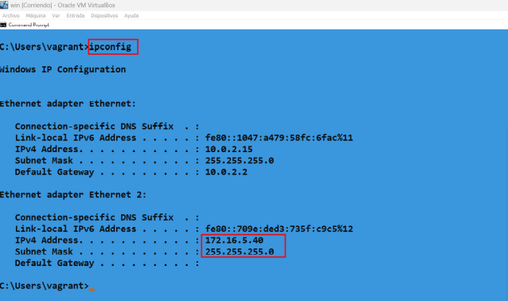

Añadimos la ip del servidor de dominio en los servidores de resolución de ***dns*** para poder añadir el equipo al dominio 

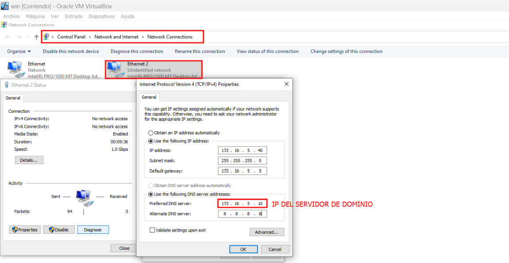

Después cambaimos el nombre al equipo para así poder indentificarlo mejor a la hora de buscarlo en el servidor . Te pedirá que reinicies el equipo , lo reinicias y esperamos a que reinice para que tome el nuevo nombre 

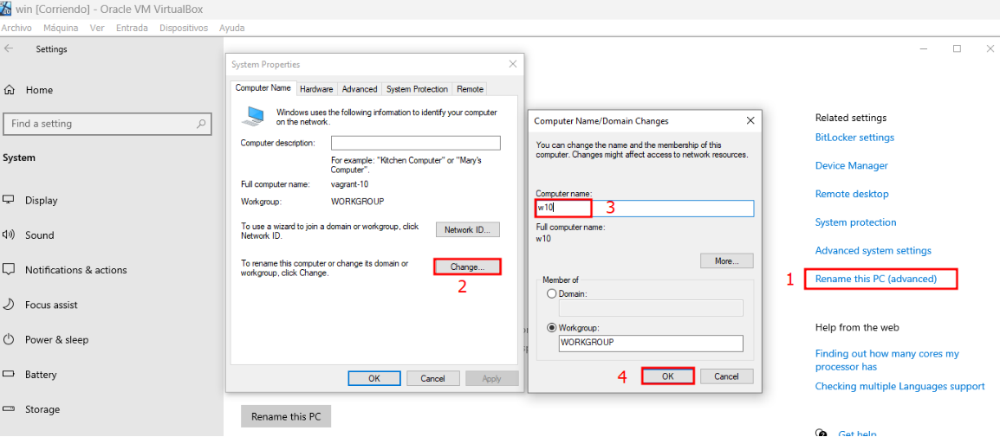

### 1.2 Unir Equipo al Dominio

Ahora iniciamos con la unión del dominio de la siguiente manera . Lo unimos con el usuario **"Administrator"** que es el biene por defecto en los dominios para iniciar sesión 

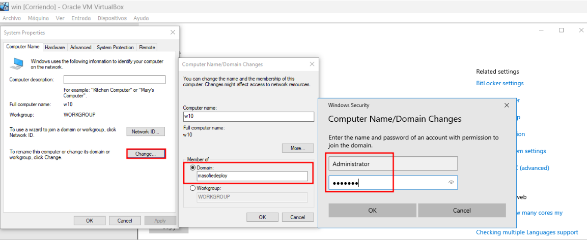

***"POSIBLE ERROR : A LA HORA DE UNIR EL EQUIPO AL DOMINIO PUEDE QUE NO LO ENCUENTRE Y TE DE FALLOS ENTONCES PARA SOLUCIONAR ESTE PROBLEMA SOLO ACTULIZAMOS EL SERVIDOR CON UN UPDATE Y YA VEREMOS QUE NOS FUNCIONA"***

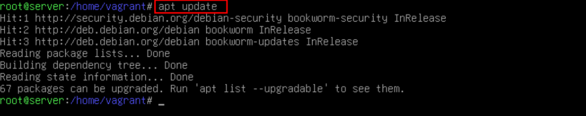

Si el dominio se unió correctamente nos muestra el siguiente mensaje en el entorno de windows , se ve de la siguiente manera 

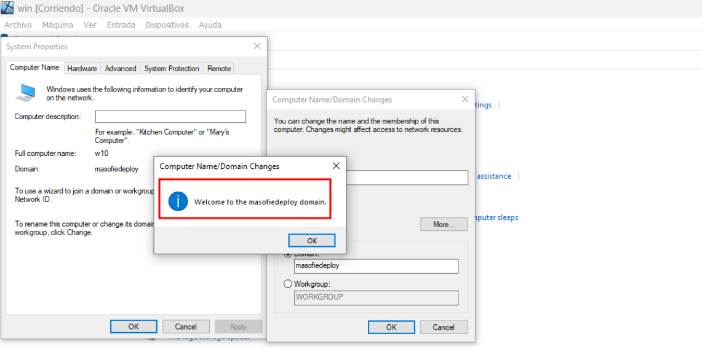

### 1.3 Comprobaciones 

Ahora comprobamos en el servidor que podmeos ver nuestro equipo de **windows 10** añadido correctamente 

~~~
samba-tool computer list
~~~

En el equipo de **Windows 10** iniciamos sesión con el usuario ***administrator*** de la siguiente manera 

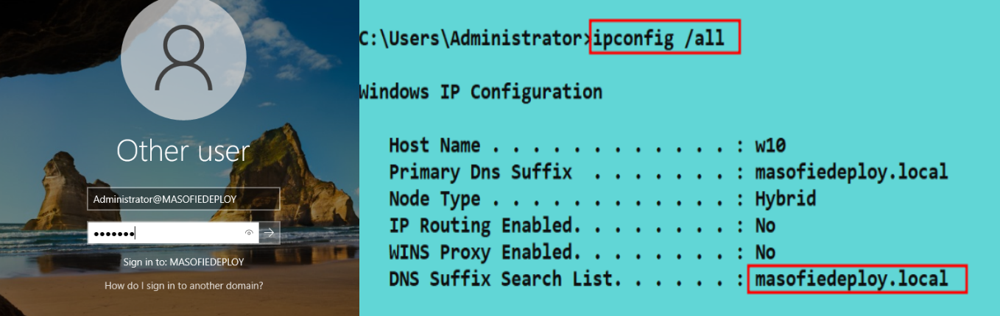

Iniciamos con un usuario que este en el dominio y desde el terminal podemos ver que esta unido correctamente 

~~~
ipconfig /all
~~~

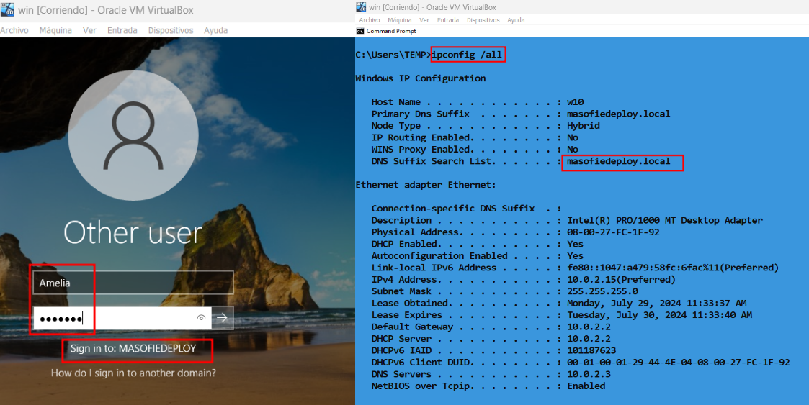

## 2. Debian-10 

### 2.1 Configuración Básica

Antes de unir el equipo al dominio comprobamos el nombre del equipo para poder comprobar desde el servidor el nombre del cliente y poder identificarlos 

~~~
hostname
~~~

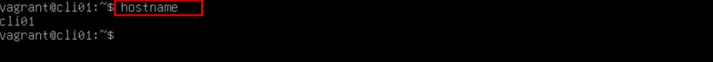

Añadimos el servidor de **DNS** en el fichero ***/etc/resolv.conf*** para buscar la resolución de nombre del dominio 

~~~
nano /etc/resolv.conf
~~~

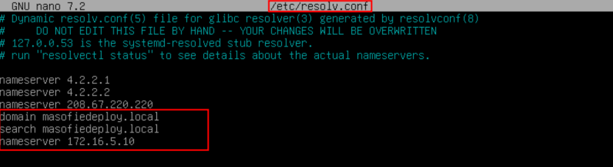

### 2.2 Instalación de Paquetes Necesarios 

Antes de instalar cualquier paquete tenemos que saber que el comando ***apt*** no funciona , para eso utilizamos el comando ***aptitude*** . Y lo instalamos . 

***"POSIBLE ERROR :*** ***ANTES DE EJECUTAR ESTOS COMANDOS ACTULIZAMOS EL SISTEMA CON UN "APT UPDATE" PARA ACTULIZAR LOS PAQUETES Y QUE FUNCIONEN CORRECTAMENTE"***

~~~
apt install aptitude
~~~

Una vez que instalamos los siguientes paquetes para configurar el Reino de **kerberos** 

~~~
aptitude search krb5-user krb5-config 
~~~

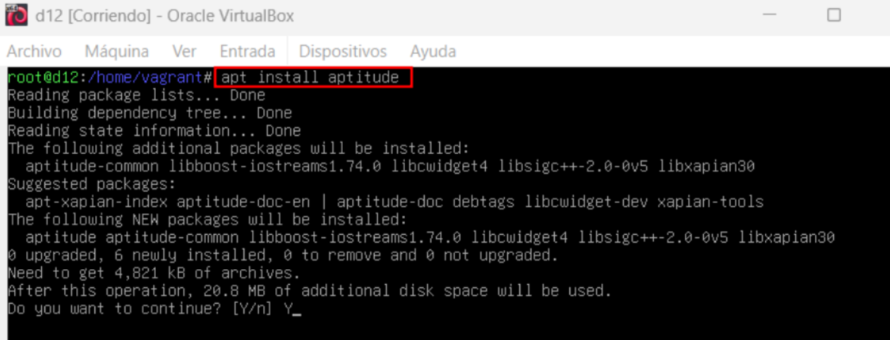

Ahora instalamos el paquete ***smbclient*** , nos va dar la posibilidad de tener acceso al dominio 

~~~
aptitude install smbclient samba-common samba-common-bin
~~~

Editamos el fichero ***/etc/samba/smb.conf*** para especificar el dominio 

~~~
nano /etc/samba/smb.conf
~~~

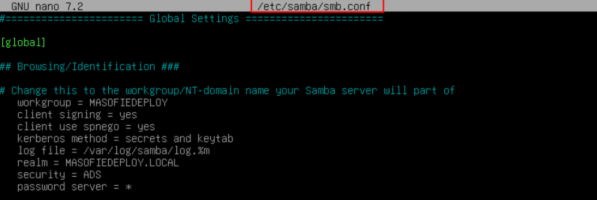

Creamos un fichero llamado ***secrets.tdb*** que lo va ha buscar en el fichero anterior los datos . Este fichero lo creamos en el directorio ***/var/lib/samba/private/*** con el nombre del usuario y el dominio que vamos ha utilizar 

~~~
nano /var/lib/samba/private/secrets.tdb
~~~

Ejecutamos el comando para unir el equipo al dominio , para ver si funciona correctamente 

~~~
net ads join -U administrator
~~~

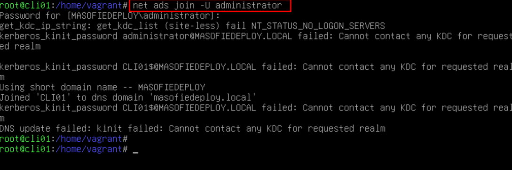

### 2.3 Comprobaciones 

Desde los clientes podemos ejecutar este comando para ver si nos resulve el nombre del dominio 

~~~
net ads testjoin
~~~
~~~
net ads info
~~~

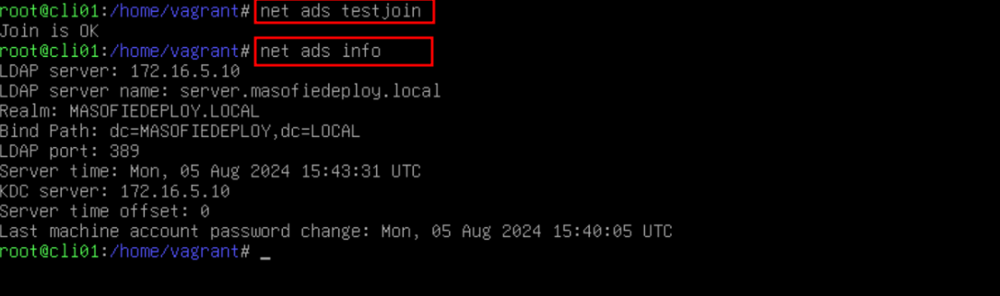

Desde el servidor comprobamos que se ha unido el equipo al cominio mostrados los equipos 

~~~
samba-tool computer list 
~~~

