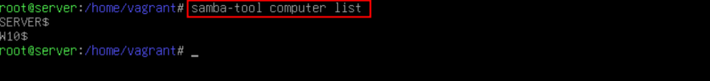

# 💻 Equipos Clientes 
<br>

**📑 Indice**
- [💻 Equipos Clientes](#-equipos-clientes)
	- [🪟 1. Windows 10](#-1-windows-10)
		- [⚙️ 1.1 Configuración Básica](#️-11-configuración-básica)
		- [🔐 1.2 Unir Equipo al Dominio](#-12-unir-equipo-al-dominio)
		- [✅ 1.3 Comprobaciones](#-13-comprobaciones)
	- [🐧 2. Debian 10](#-2-debian-10)
		- [⚙️ 2.1 Configuración Básica](#️-21-configuración-básica)
		- [📦 2.2 Instalación de Paquetes Necesarios](#-22-instalación-de-paquetes-necesarios)
		- [✅ 2.3 Comprobaciones](#-23-comprobaciones)
	- [📝 3. Archivo Necesario](#-3-archivo-necesario)
		- [📂 3.1 Vagrantfile](#-31-vagrantfile)

<br>

## 🪟 1. Windows 10
<br>

### ⚙️ 1.1 Configuración Básica
<br>


1 - 📡 Verificamos la ``ip`` del equipo para confirmar que recibió la configuración de red correctamente .


<br>
<br>


2 - 🧭 Añadimos la ``ip`` del servidor de dominio en las configuraciones de ``dns`` para que pueda resolver el nombre del dominio.


<br>
<br>


3 - 🖥️ Cambiamos el nombre del equipo para facilitar su identificación desde el servidor .💡 Windows solicitará reiniciar para aplicar el nuevo nombre.


<br>
<br>


### 🔐 1.2 Unir Equipo al Dominio
<br>

1 - Iniciamos el proceso de unión al dominio con el usuario ``Administrator`` (por defecto en Samba)


<br>
<br>


2 - ⚠️ ``POSIBLE ERROR`` : Si no encuentra el dominio, actualiza el servidor con :
 
 ```bash
apt update
 ```


<br>
<br>


3 - Si la unión es correcta, Windows mostrará un mensaje de confirmación. 🎉


<br>
<br>


### ✅ 1.3 Comprobaciones
<br>

1 - Desde el servidor, ejecutamos :

 ```bash
samba-tool computer list
 ```
<br>

🔎 Aquí debe aparecer el nombre del equipo Windows.



<br>
<br>


2 - En Windows, iniciamos sesión como ``Administrator`` del dominio.
 


<br>
<br>


3 - También podemos comprobar desde terminal :

~~~
ipconfig /all
~~~


<br>
<br>


## 🐧 2. Debian 10
<br>

### ⚙️ 2.1 Configuración Básica
<br>

1 - Verificamos el nombre del equipo con :

~~~
hostname
~~~

<br>

🏷️ Esto facilita identificarlo desde el servidor.


<br>
<br>


2 - Editamos el archivo ``/etc/resolv.conf`` y añadimos la IP del servidor ``dns`` :

~~~
nano /etc/resolv.conf
~~~


<br>
<br>


### 📦 2.2 Instalación de Paquetes Necesarios
<br>

1 - ⚠️ Si ``apt`` no funciona , usamos ``aptitud`e`` . Un posible error es ``NO ENCONTRAR EL DOMINIO``  por eso hay que usar el *``update`` : 

~~~
apt update
apt install aptitude
~~~
<br>
<br>


2 - Instalamos los paquetes necesarios para ``Kerberos`` :

~~~
aptitude search krb5-user krb5-config 
~~~


<br>
<br>


3 - Instalamos herramientas para Samba : 

~~~
aptitude install smbclient samba-common samba-common-bin
~~~


<br>
<br>


4 - Editamos el fichero de configuración :

~~~
nano /etc/samba/smb.conf
~~~


<br>
<br>


5 - Creamos el archivo ``secrets.tdb`` en :

~~~
/var/lib/samba/private/secrets.tdb
~~~


<br>
<br>


6 - Finalmente , unimos el equipo al dominio :

~~~
net ads join -U administrator
~~~


<br>
<br>


### ✅ 2.3 Comprobaciones
<br>

1 - Desde el cliente , comprobamos nuestro dominio :

~~~
net ads testjoin
net ads info
~~~


<br>
<br>


2 - Desde el servidor listamos los equipos unidos al dominio :

~~~
samba-tool computer list
~~~


<br>
<br>


## 📝 3. Archivo Necesario
<br>

### 📂 3.1 Vagrantfile
<br>


~~~
# Variables
interfaz_bridge = "eno1"
ip_pub = "192.168.1.100"
mascara = "255.255.255.0"

Vagrant.configure("2") do |config|
  config.vm.box = "generic/debian12"

  config.vm.define "fw" do |fw|
    fw.vm.hostname = "fw"
    fw.vm.network "public_network", bridge: interfaz_bridge, ip: ip_pub, netmask: mascara
    fw.vm.network "private_network", ip: "172.16.5.5", netmask: "255.255.255.0", gateway: "172.16.5.1"

    fw.vm.provision "shell", run: "always", path: "enrutamiento.sh"
    fw.vm.provision "shell", run: "always", path: "iptables.sh"
    fw.vm.provision "shell", run: "always", inline: "ip route del default"
    fw.vm.provision "shell", run: "always", inline: "ip route add default via 192.168.1.1"

    fw.vm.provider "virtualbox" do |vb|
      vb.name = "fw"
      vb.gui = true
      vb.memory = "1024"
      vb.cpus = 1
      vb.linked_clone = true
      vb.customize ["modifyvm", :id, "--groups", "/MasofieAutoDeploy"]
    end
  end
end
~~~